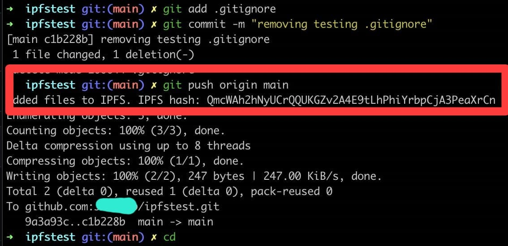

# 4RealOSS

# BlockchainRealOSS
Initial Real Blockchain Open Source Software - git push your projects into IPFS and your remote repo at the same time, to the blockchain - Your footprint to the worlds.
### Prerequisites
- Have git installed
- Have ipfs installed (https://docs.ipfs.eth.link/install/command-line/#system-requirements)

## Instructions:
- clone this project (or just add magic.sh to your local repo)
- copy magic.sh into your local project/repository (your project needs to have git intialized already)
- run magic.sh from your terminal/CMD/Powershell (make sure file has execute permissions i.e "chmod +x magic.sh")
  - Unix/Linux systems: ./magic.sh
  - Windows systems: bash magic.sh
- proceed to use git normally as always, project will be pushed to ipfs eveytime you push to your remote repo.
- your ipfs hashes (CID) are stored at the .ipfs_hashes file, we use these on the blockchain contract as reference to our projects. Just need to sign.

#### Coming up..
- command to trigger blockchain transaction to reference CID (Metamask)
- UI similar to GitHub/GitLab/Gogs " for now use the one you always use :) " we will feature commits-to-ipfs and commit-to-blockchain buttons.
- Install globally on git to be applied to all/any repo.
